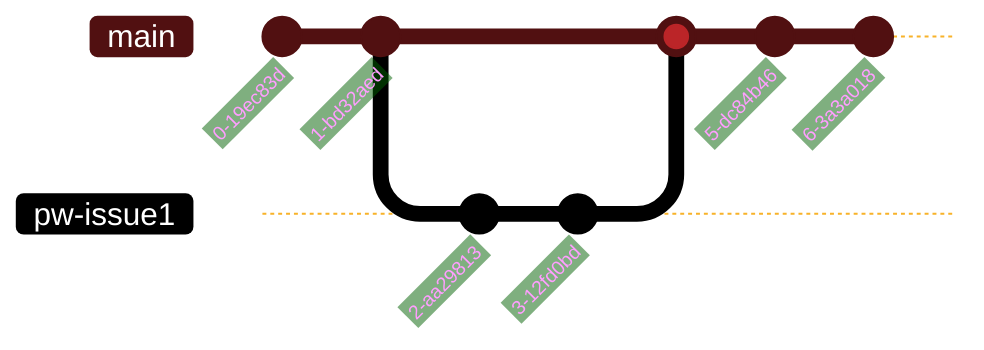

# personal-website
repo for Blakely Mayhall's personal website

# Issue / Feature Tracking 
Handled in Jira
- https://blakelycmayhall.atlassian.net/jira/software/projects/PW/boards/3

# Git strategy 
- Git strategy will be feature branches off main
- Branch names will follow the following criteria:
	- Phase branches: \<JiraTag>_\<shortname>
	- Feature branches: \<JiraTag>_\<shortname>

